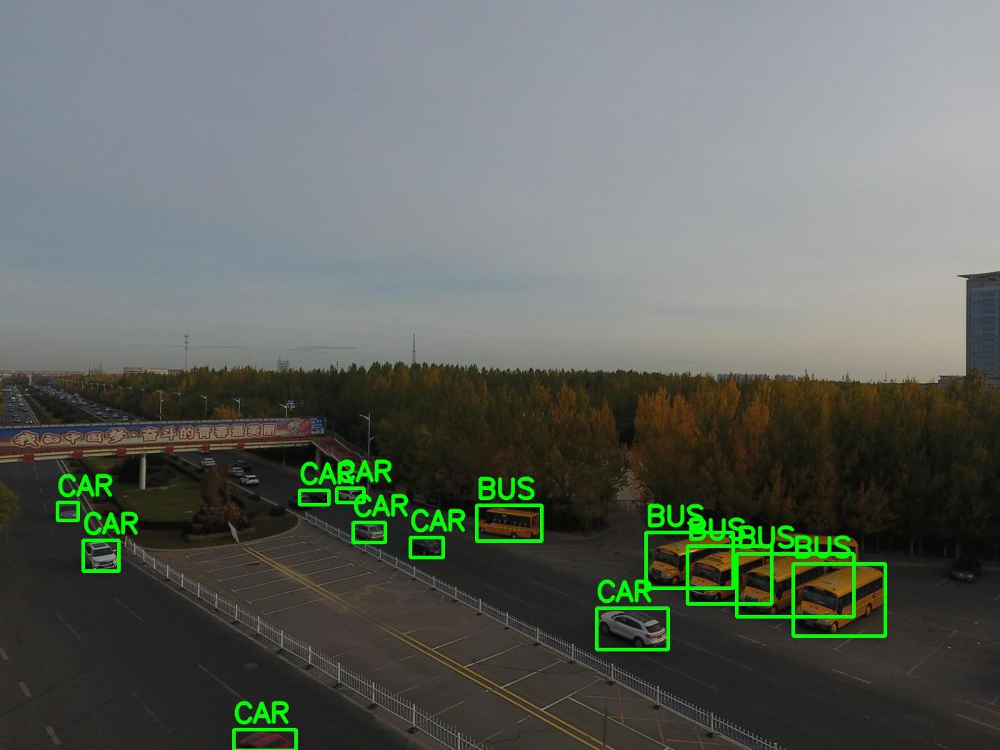

## **Object detection in VisDrone dataset using YOLO**

This repository contains the implementation of a object detection API using YOLO (You Only Look Once) neural network model trained for detecting objects in drone images (trained with VisDrone data: https://github.com/VisDrone/VisDrone-Dataset). The model is trained using the YOLOv8n architecture and the training process was carried out in Google Colab.

<div style="text-align:center;">
  
</div>


### **Usage**

#### **Training**

The training process is executed in the train.ipynb notebook, specifically designed for Google Colab. Follow these steps to train the model:

    - Enable Google Colab GPUs.
    - Upload your dataset and necessary files to Google Colab.
    - Execute the cells in train.ipynb to train the YOLO model on your dataset.
    - Once training is complete, download the trained weights and training informations

#### **Prediction**

After obtaining the trained weights, an API has been developed for utilizing the model to detect objects in images. Follow these steps to run the API:

    - Set up a local environment with the required dependencies (specified in requirements.txt).
    - Run the API to analyze images and obtain detected object classes.

### **Directory Structure**

    train.ipynb: Jupyter notebook for training the YOLO model in Google Colab.
    yolo_config.yaml: Model training instructions, should be uploaded to the Colab root directory.
    src/: Data preparation and prediction code.
    src/api/: Contains the source code for the API.
    VisDrone/: Dataset and related files.
    runs/: Location of the trained model weights and informations.

### **Dependencies**

Ensure you have the necessary dependencies installed. You can install them using:

```
pip install -r requirements.txt
```

### **Running the API**

#### **Enviromental variables**

The project must have a ```.env``` with:

    PORT="2023"
    PATH_LOG='logs'

#### **Running the API using python**

```
python main.py
```

#### **Running the API using Docker**

To build the Docker image, run the following command:

    docker build -t objdetection .

And to start the Docker container and map port 2023 on the host to port 2023 on the container, run the following command:

    docker run -p 2023:2023 objdetection


## **API**

### **Input**

```
{
    "request_id": 173
    "file": ... # is uploaded in the user interface
}
```

### **Output**

```
{
    "detected_objects_cls": ["CAR", "CAR", "TRICYCLE"], 
    "runtime": 0.713
}

```